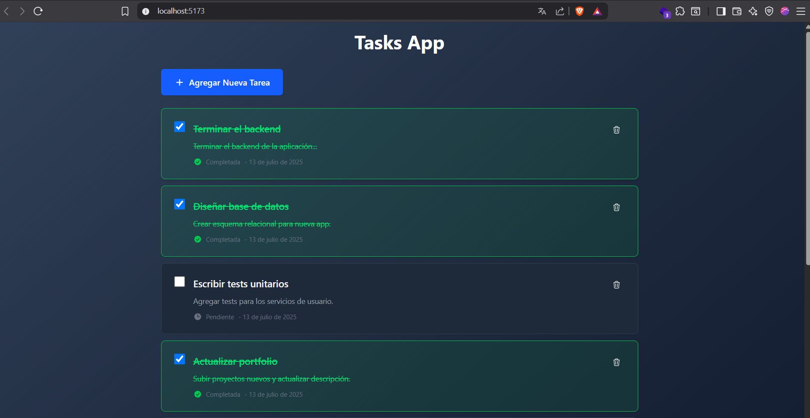
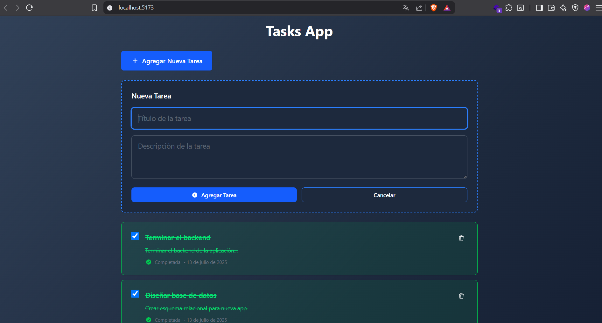

# Fullstack Task Manager - Challenge ForIT

Este proyecto es una aplicación fullstack desarrollada como parte de un challenge de ingreso para la academia **ForIT**. Permite gestionar tareas (crear, editar, eliminar y listar) y está dividido en dos carpetas:

- **Frontend:** Construido con React, TypeScript y Tailwind CSS.
- **Backend:** API RESTful creada con Node.js, Express y SQLite.

---

## Estructura del Proyecto

- frontend/ → Aplicación cliente en React
- backend/ → Servidor y API REST
- README.md → Documentación general

---

## Requisitos Previos

- Node.js (versión recomendada: 18+)
- npm o yarn
- SQLite3 (opcional, ya que la DB se crea automáticamente)

---

## Instalación y Ejecución

### Clonar el repositorio

```bash
git clone https://github.com/ronyAlm/tasks-app
cd tasks-app
```

### 1 Iniciar el servidor backend

cd backend
npm install
npm run dev

### 2 Iniciar la aplicación frontend (En otra terminal)

cd frontend
npm install
npm run dev

### 3 Acceder a la aplicación en el navegador

La app estará corriendo en http://localhost:5173 (por defecto Vite) y el backend en http://localhost:3005.

---

## Funcionalidades

Crear, editar, eliminar y listar tareas

Estilo moderno y responsive con Tailwind

Comunicación entre frontend y backend mediante API RESTful

---

## Capturas de Pantalla





## Creditos

Desarrollado por [Rony Almirón](https://github.com/ronyAlm)
